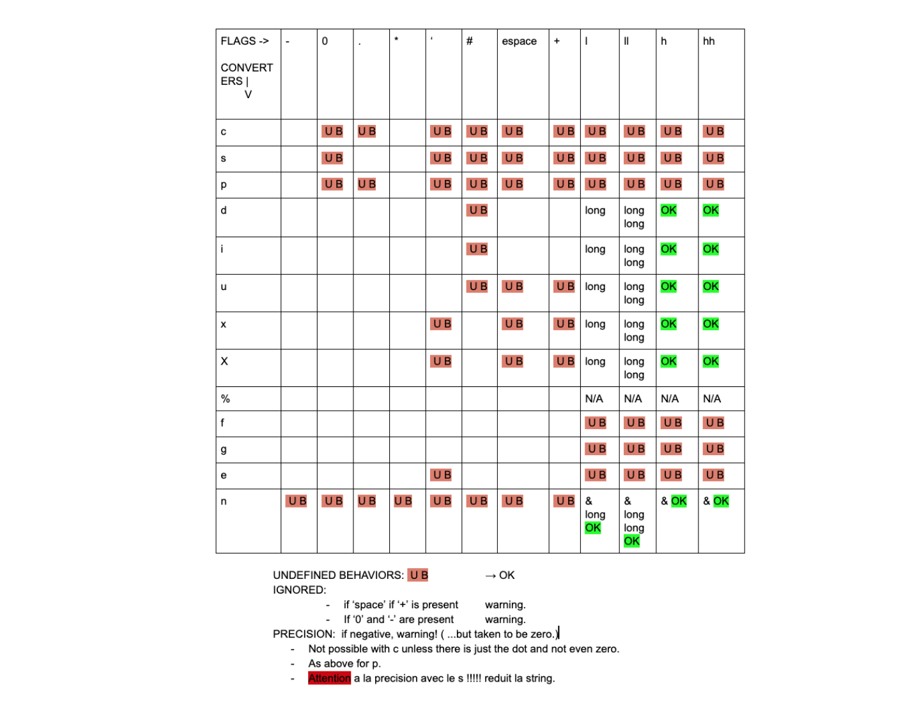

# Ft_printf
This project is pretty straight forward. You will recode printf.
Hopefully you will be able to reuse it in future project without the fear of being flagged as a cheater.
You will mainly learn how to use **variadic arguments**.

## Mandatory part
+ Prototype
`ft_printf(const char *, ...);`

+ Conversion
`c, s, p, d, i, u, x, X, %`

+ flag
`-, 0, ., *`

## Tester
1. ./test
2. pft : https://github.com/gavinfielder/pft
3. 42TESTER_PRINTF : https://github.com/Mazoise/42TESTERS-PRINTF
4. printf_lover_v2 : https://github.com/charMstr/printf_lover_v2

## Printf table

